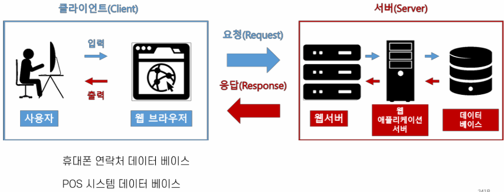

### 프로디지털 아카데미 프론트 리액트 강의 (5/16)

### 데이터베이스
- 여러 사람에 의해 공유되어 사용될 목적으로 통합하여 관리되는 데이터의 집합을 말한다.

### 웹 서버에서의 Database

### RDBMS - 전통적인 DB
- RDB: 관계형 데이터베이스 
- 상호 관련성이 있는 테이블의 집합
- ER 모델
- 범용성: 다양한 용도 사용가능
- 고성능: 높은 성능
- 데이터의 일관성을 보증
- 정규화 -> 갱신 비용 최소화

### NO SQL
- SQL뿐만 아니라, DATA 관리하는 데에 SQL 뿐만 있는게 아니다.
-> SQL 말고 다른 방법도 잇다.
- 전통적인 RDB보다 덜 제한적인 일관성 모델을 이용하는 데이터의 저장 및 검색을 위한 매커니즘을 제공한다.
- 이러한 접근에 대한 동기에는 디자인의 단순화, 수평적 확장성, 세세한 통제를 포함한다.
- No SQL 데이터베이스는 단순 검색 및 추가 작업을 위한 매우 최적화된 키 값 저장 공간으로, 레이턴시와 스루풋과 관련하여 상당한 성능 이익을 내는 것이 목적이다.
- No SQL 데이터베이스는 빅데이터와 실시간 웹 어플리케이션의 상업적 이용에 널리 쓰인다.

### RDB VS NOSQL
1. SQL
[이미지2](./docs/image1.png)

2. No SQL
[이미지3](./docs/image2.png)

- 각자 개발하고자 하는 제품/서비스에 맞는 데이터 베이스면 모두 OK
- DB의 신뢰성이 중요하면 -> RDBMS
- DB의 유연성과 확장성이 중요하면 -> No SQL

### MongoDB
- MongoDB는 Document-Oriented (문서 지향적) No SQL 데이터베이스
- 오픈 소스이며 엔진은 C++로 작성되었다.
- JSON Object 형태의 key-value의 쌍으로 이루어진 데이터 구조로 구성된다.
- Document는 RDBMS의 row와 유사한 개념으로 Json object 형태의 key-value의 쌍으로 이루어진 데이터 구조로 구성된다.
- value에는 다른 document, array, document array가 포함될 수 있다.
- MongoDB의 저장구조
[이미지4](./docs/image3.png)
  
- Database: RDB의 스키마
- Collection: RDB의 테이블
- Document: RDB의 Row => 각 Document는 _id라는 고유한 값을 가짐
- Database는 0개 이상의 Collection들의 집합으로 구성되며
- Collection은 0개 이상의 Document로 구성되고,
- Document는 1개 이상의 field로 구성된다.

### Mongo DB의 가장 큰 특징
: SchemaLess
- RDBMS처럼 고정 스키마가 존재하지 않는다!
- 같은 Collection 내에 있더라도 document level의 다른 스키마를 가질 수 있다는 의미이다!
- MongoDB는 하나의 Collection 내의 Document가 각각 다른 스키마를 가질 수 잇음
- 동적 스키마

### Mongoose
- ODM -> ORM과 비슷하지만, R이 아닌, D (document)이다.
- 디비를 application level에서 객체처럼 사용하도록 하는 것!

