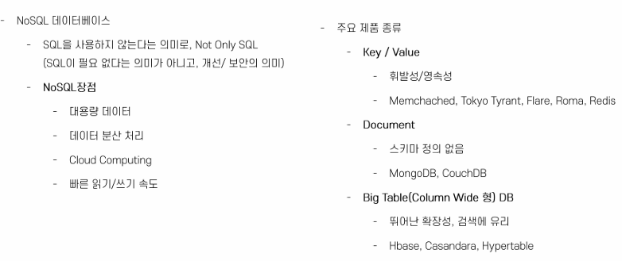
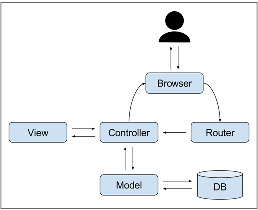

### 프로디지털 아카데미 프론트 리액트 강의 (5/16)

### 데이터베이스

- 여러 사람에 의해 공유되어 사용될 목적으로 통합하여 관리되는 데이터의 집합을 말한다.

### 웹 서버에서의 Database


### RDBMS - 전통적인 DB

- RDB: 관계형 데이터베이스
- 상호 관련성이 있는 테이블의 집합
- ER 모델
- 범용성: 다양한 용도 사용가능
- 고성능: 높은 성능
- 데이터의 일관성을 보증
- 정규화 -> 갱신 비용 최소화

### NO SQL

- SQL뿐만 아니라, DATA 관리하는 데에 SQL 뿐만 있는게 아니다.
  -> SQL 말고 다른 방법도 잇다.
- 전통적인 RDB보다 덜 제한적인 일관성 모델을 이용하는 데이터의 저장 및 검색을 위한 매커니즘을 제공한다.
- 이러한 접근에 대한 동기에는 디자인의 단순화, 수평적 확장성, 세세한 통제를 포함한다.
- No SQL 데이터베이스는 단순 검색 및 추가 작업을 위한 매우 최적화된 키 값 저장 공간으로, 레이턴시와 스루풋과 관련하여 상당한 성능 이익을 내는 것이 목적이다.
- No SQL 데이터베이스는 빅데이터와 실시간 웹 어플리케이션의 상업적 이용에 널리 쓰인다.

### RDB VS NOSQL

1. SQL
   

2. No SQL
   

- 각자 개발하고자 하는 제품/서비스에 맞는 데이터 베이스면 모두 OK
- DB의 신뢰성이 중요하면 -> RDBMS
- DB의 유연성과 확장성이 중요하면 -> No SQL

### MongoDB

- MongoDB는 Document-Oriented (문서 지향적) No SQL 데이터베이스
- 오픈 소스이며 엔진은 C++로 작성되었다.
- JSON Object 형태의 key-value의 쌍으로 이루어진 데이터 구조로 구성된다.
- Document는 RDBMS의 row와 유사한 개념으로 Json object 형태의 key-value의 쌍으로 이루어진 데이터 구조로 구성된다.
- value에는 다른 document, array, document array가 포함될 수 있다.
- MongoDB의 저장구조

  

- Database: RDB의 스키마
- Collection: RDB의 테이블
- Document: RDB의 Row => 각 Document는 \_id라는 고유한 값을 가짐
- Database는 0개 이상의 Collection들의 집합으로 구성되며
- Collection은 0개 이상의 Document로 구성되고,
- Document는 1개 이상의 field로 구성된다.

### Mongo DB의 가장 큰 특징

: SchemaLess

- RDBMS처럼 고정 스키마가 존재하지 않는다!
- 같은 Collection 내에 있더라도 document level의 다른 스키마를 가질 수 있다는 의미이다!
- MongoDB는 하나의 Collection 내의 Document가 각각 다른 스키마를 가질 수 잇음
- 동적 스키마

### Mongoose

- ODM -> ORM과 비슷하지만, R이 아닌, D (document)이다.
- 디비를 application level에서 객체처럼 사용하도록 하는 것!

### Express 시작하기!

- 우린 NPM이 있다!
- `npx express-generator --view=ejs my-express` : npx: 1회성 패키지 명령 실행
- 진입점: `/bin/www`
- module이 아닌 commonjs이 default로 되어있음 -> 우리도 여기서 이를 따를 것
- `node_modules`가 없음: `npm install` 해줘야 한다!
- `npm run start` : script에 정의된 start가 실행된다.
- 파일이 한번에 너무 많이 생겨서 디렉토리가 복잡하다 : package.json 보기
- app.js 수정하는 경우 -> 다시 껐다가 켜야한다 ㅠ -> 수정하면 알아서 적용! `npm install --save-dev nodemon`
- package.json에서 script 수정

```json
"scripts": {
    "start": "node ./bin/www",
    "dev": "nodemon ./bin/www"
  },
```

### 라우터

- post는 여기로 가고~ board는 저기로 가고~ 이렇게 교통 정리해주는게 라우터
- /routes: routing에 필요한 파일들 모아 있는 디렉토리
- 인자: serving할 url, controller

- index.js

```jsx
var express = require("express");
var router = express.Router();

/* GET home page. */
router.get("/", function (req, res, next) {
  res.render("index", { title: "Express" });
});

module.exports = router;
```

- user.js

```jsx
var express = require("express");
var router = express.Router();

/* GET users listing. */
router.get("/", function (req, res, next) {
  res.send("respond with a resource");
});

module.exports = router;
```

- app.js

```jsx
app.use("/", indexRouter); // 기본 시작 url
app.use("/users", usersRouter); // 기본 url / users
```

- 장고에서 config urls.py와 각 app별로 urls.py 두는 것이랑 비슷한 구조

### MVC란?

- 웹 애플리케이션에서 일반적인 MVC 구성요소 다이어그램
  
- **Model**: DB와의 커넥션을 담당하는 영역

  - default로 없으니, 만들어야 한다.

- **View**: 결과물을 생성하는 영역 - reponse를 어떻게 보여줄지 처리하는 영역

  - views에서 이 역할을 함
  - ejs
  - template 엔진
  - 하지만, 우리는 react로 화면을 구성할 것이므로, view 폴더를 삭제
  - app.js에서 다음 코드 삭제

  ```jsx
  // view engine setup
  app.set("views", path.join(__dirname, "views"));
  app.set("view engine", "ejs");
  ```

  - routes에서 `render`: view engine -> 삭제
  - 아래 코드 삭제

  ```jsx
  res.render("index", { title: "Express" });
  ```

- **Controller**: Model과 View를 핸들링하고, 로직을 처리하는 영역, request를 처리하는 영역 (장고에서 views.py)
  - routes가 이 역할을 함

### Express에서의 MVC


- 라우팅: 라우팅은 애플리케이션 엔드포인트 (URI)의 정의, 그리고 URI가 클라이언트 요청에 응답하는 방식을 말합니다.

```jsx
app.get("/", function (req, res) {
  console.log(req);
  console.log(req.header);

  res.send("hello world");
});
```

- **router는 controller이다!**
- **우리가 할 것은?**

  - 어떤 메소드로 요청을 받을 것인가?
  - 어떤 URL로 요청을 받을 것인가?
  - 어떤 로직을 처리해줄 것인가?
  - 어떤 응답을 줄 것인가?

- 라우터 만들기

```jsx
const express = require("express");
const router = express.Router();

router.get("/", (req, res) => {
  res.send("My First Board");
});

module.exports = router;
```

- 라우터 app에 등록

```jsx
const boardRouter = require("./routes/board");

app.use("/board", boardRouter); // Express App에 사용하겠다고 등록해준다!
```

- 라우터는 순서가 중요하다!
  - 위에서부터 아래로 떨어지기 때문에, 가장 먼저 충족하는 request에 대해 응답을 보내준다!

### Express.js에 Mongoose 사용하기

- mongoDB에서 create cluster > driver 선택 > node.js로
- `npm install mongoose`
- app.js에 다음과 같이 추가

```jsx
const mongoose = require("mongoose");
mongoose
  .connect(
    "mongodb+srv://sun:<password>@cluster0.lmbrrnm.mongodb.net/?retryWrites=true&w=majority&appName=Cluster0"
  )
  .then(() => console.log("Connected Successful"))
  .catch((err) => console.log(err));
```
